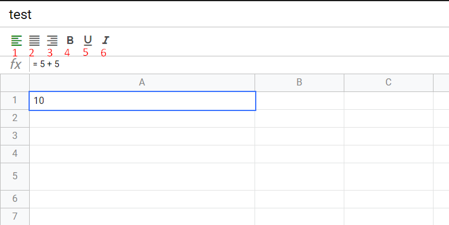
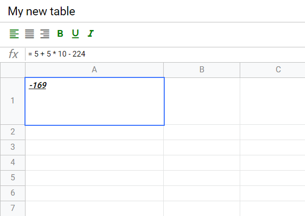

https://qallpaq.github.io/Excel/

<h1>Навигация</h1>

1. При помощи стрелок(<- / -> и тд)
2. Enter переход на новую строчку
3. Enter + shift переход на новую строчку внутри ячейки
4. Tab переход в слудующую колону

<h2>Работа с текстом</h2>

</img>

1. text-align: left;
2. text-align: center;
3. text-align: right;
4. font-weight: bold;
 
5: text-decoration: underline;
6: font-style: italic;

<h2>Математические операции начинаются со знака '=' </h2>

</img>

<h2>Ресайз</h2>

</img>

<h2>Так же доступно</h2>

</img>

1. удаление таблицы
2. перейти к выбору таблицы
